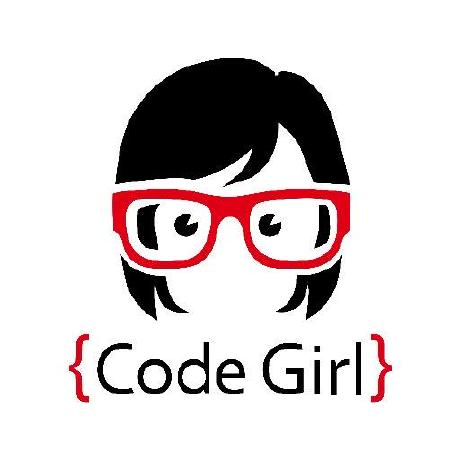

# Karlygash Yakiyayeva 🎄🎅 2022

[]()

## 🔥Junior Frontend Developer🔥

### Contact information
- **Location**: Kazakhstan, Almaty    
- **Phone**: +7 (708) 985 81 49
- **Email**: yakiyaeva@gmail.com
- **GitHub**: [karlakz](https://github.com/karlakz)

### About Me

I think coding is a skill of the 21st century 
that has quickly become as necessary a skill as 
writing and reading and is important for a wide 
range of professions. 

In addition, programming
careers have great earning potential and demand 
for coding-related jobs is high. Therefore, 
I have a great desire to learn to write codes 
professionally. I am a quick learner and I always
work on myself by participating in different 
online courses, webinars, events, and meetups. 
I spend my free time reading and self-development.

My main goal is to learn how to write codes in JavaScript and become a professional front-end developer.

### Skills
- HTML
- CSS3
- Vanilla JavaScript
- Git

### Tools
- VS Code


### Code Example
Create a function that takes an integer as an argument and returns "Even" for even numbers or "Odd" for odd numbers.

``` 
const even_or_odd = number => number % 2 === 0 ? 'Even' : 'Odd'
```

### Experience 
I have no professional experience at web development at the moment, but I am going to pursue a career as a front-end developer in the future.

### Education
- Master of Science | the University of York, UK 2016 – 2017 Specialized in Communications Engineering Overall Percentage – 65/100. Second Class Upper        
- Bachelor of Engineering and Technology | L.N Gumilyov Eurasian National University, Astana 2009 – 2013 GPA – 3.62/4 Distinction. Specialized in Radio Engineering, Electronics and Telecommunications

### Certificates and Courses
1. Introduction to Internet of Things, 2018 Cisco Networking Academy
2. Linux Essentials , 2018 Cisco Networking Academy

### Languages
- English: IELTS Academic with overall score 7.0 (Advanced), 2018
- Kazakh: Native
- Russian: Full fluency
- French: A2 Pre-intermediate

<br>

[](https://rs.school/)
